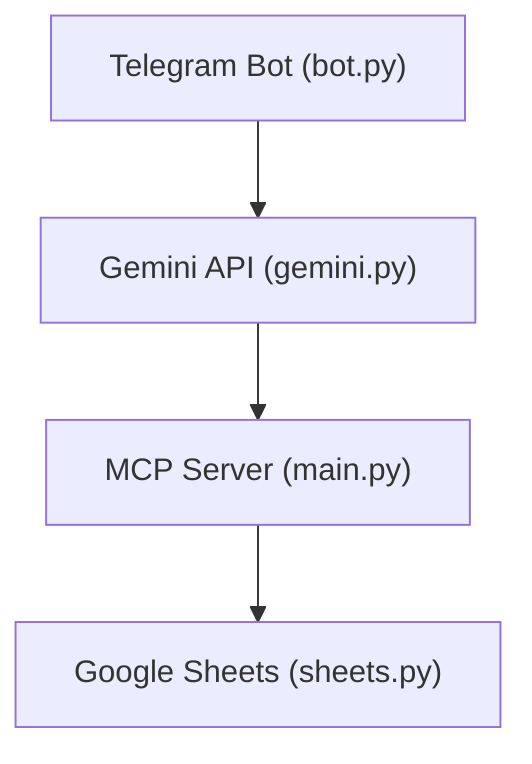

# Teekkarivisa bot & MCP-server

This app consists of:
- An MCP server (`main.py`) for managing quiz logic and state
- A Telegram bot (`bot.py`) for user interaction
- Gemini API integration (`gemini.py`) for AI-powered responses
- Google Sheets integration (`sheets.py`) to fetch quiz questions

